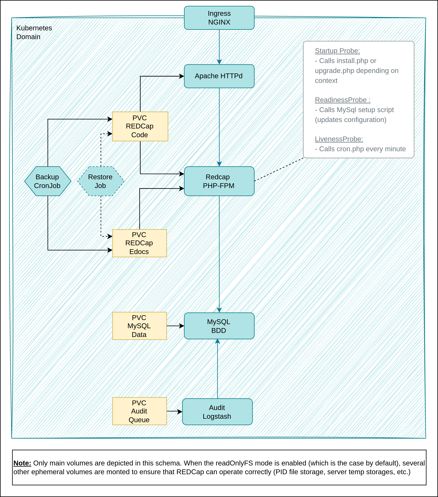

# redcap

  

A Helm chart to deploy REDCap on a Kubernetes cluster.

**Homepage:** <https://www.project-redcap.org/>

## Maintainers

| Name | Email | Url |
| ---- | ------ | --- |
| kzgrzendek | <kevin.zgrzendek@gmail.com> | <https://github.com/kzgrzendek> |

## Source Code

* <https://github.com/aphp/redcap-helmchart>

## Requirements

Kubernetes: `>= 1.24.0-0`

| Repository | Name | Version |
|------------|------|---------|
| https://charts.bitnami.com/bitnami | audit(logstash) | 7.0.2 |
| https://charts.bitnami.com/bitnami | mysql | 13.0.0 |

## Deployment Architecture

This Chart allows the Datalab to be deployed as follows :



## Installing the Chart

The default Chart values allows the deployment of a working (although unsecure) version of the Chart

To install the chart, just type :

```sh
helm install redcap aphp-redcap/redcap -f ./examples/basic-install.yaml
```

## Values

### REDCap Audit Log Shipper settings

| Key | Type | Default | Description |
|-----|------|---------|-------------|
| httpd.enabled | bool | `true` | If `true`, activates the deployment of the Apache HTTPd proxy. |
| httpd.image.repository | string | `"ghcr.io/aphp/redcap-httpd-shibd"` | Image repository for Apache HTTPd. |
| httpd.image.tag | string | `"1.2.0"` | Image tag for Apache HTTPd. |
| httpd.image.pullPolicy | string | `"Always"` | PullPolicy for Apache HTTPd's image. |
| httpd.tls.enabled | bool | `false` | If `true` activates TLS termination on the Apache HTTPd proxy. |
| httpd.tls.certificate | object | `{"existingSecret":""}` | Configuration relating to the server TLS certificate. |
| httpd.tls.certificate.existingSecret | string | `""` | Name of the existing Secret holding the certificate for the TLS termination. The secret must be of type `tls`. |
| httpd.tls.caChain | object | `{"secretKeyRef":{"key":"","name":""}}` | Configuration relating to the certification chain certificate. |
| httpd.tls.caChain.secretKeyRef | object | `{"key":"","name":""}` | Reference of an existing Secret holding the certificate for the certification chain, if needed. |
| httpd.tls.caChain.secretKeyRef.name | string | `""` | The name of the existing Secret holding the certificate for the certification chain, if needed. |
| httpd.tls.caChain.secretKeyRef.key | string | `""` | The key inside the existing Secret holding the certificate for the certification chain, if needed. |
| httpd.shibboleth.enabled | bool | `false` | If `true`, activates the Shibboleth daemon, which enables is needed for enabling SAMLv2 authentication with REDCap. |
| httpd.shibboleth.sp.entityID | string | `""` | EntityID of the SAMLv2 Service Provider (SP). |
| httpd.shibboleth.sp.metadata.certificate.existingSecret | string | `""` | Reference to the secret holding the metadata file for the Service Provider. |
| httpd.shibboleth.idp.entityID | string | `""` | EntityID of the SAMLv2 Identity Provider (IdP). |
| httpd.shibboleth.idp.metadata.secretKeyRef.name | string | `""` | Name of the secret holding the metadata file for the Identity Provider. |
| httpd.shibboleth.idp.metadata.secretKeyRef.key | string | `""` | Key of the secret holding the metadata file for the Identity Provider. |
| httpd.replicaCount | int | `1` | Number of replicas wanted for the Apache |
| httpd.resources | object | `{}` | Resources for the Apache HTTPd pod(s). |
| httpd.nodeSelector | object | `{}` | Node Selector for the the Apache HTTPD pod(s). |
| httpd.tolerations | list | `[]` | Toleration for the the Apache HTTPD pod(s). |
| httpd.affinity | object | `{}` | Affinity for the the Apache HTTPD pod(s). |

### Autoscaling settings

| Key | Type | Default | Description |
|-----|------|---------|-------------|
| redcap.install.enabled | bool | `true` | If `true`, enables REDCap installation process. |
| redcap.install.image.repository | string | `"alpine/curl"` | Image repository for REDCap installation process. |
| redcap.install.image.tag | string | `"8.12.1"` | Image tag for REDCap installation process. |
| redcap.install.image.pullPolicy | string | `"Always"` | PullPolicy for REDCap installation process. |
| redcap.install.version | string | `"15.0.27"` | Version of the REDCap package to install |
| redcap.install.communityAuth.username | string | `""` | Username of the REDCap Community user with whom the installation package is downloaded. Ignored if `existingSecret` is used. |
| redcap.install.communityAuth.password | string | `""` | Password of the REDCap Community user with whom the installation package is downloaded. Ignored if `existingSecret` is used. |
| redcap.install.communityAuth.existingSecret | string | `""` | Existing secret containing the credentials of the REDCap Community user with whom the installation package is downloaded. |
| redcap.install.overrideInstallContainer | list | `[]` | Overrides the initContainers that downloads the REDCap application package. |
| redcap.image.repository | string | `"ghcr.io/aphp/redcap-php-fpm"` | Image repository for REDCap PHP-FPM Image. |
| redcap.image.pullPolicy | string | `"Always"` | PullPolicy for REDCap PHP-FPM Image. |
| redcap.image.tag | string | `"1.2.0"` | Tag for REDCap PHP-FPM Image. |
| redcap.extraInitContainers | list | `[]` | Add additional init containers to the PHP-FPM container hosting the REDCap application. |
| redcap.extraContainers | list | `[]` | Add additional containers to the PHP-FPM container hosting the REDCap application. |
| redcap.extraVolumes | list | `[]` | Add additional volumes to the PHP-FPM container hosting the REDCap application. |
| redcap.config.logAllErrors | string | `"FALSE"` | If set to `true`, will log all the errors on the stdout (NOT RECOMMENDED IN PRODUCTION). |
| redcap.config.externalURL | string | `"http://localhost/"` | The URL on which the application is exposed (useful if the application is behind a reverse-proxy). |
| redcap.config.institutionName | string | `"REDCap Local Institution"` | The name of the institution that is presented to the users. |
| redcap.config.organizationName | string | `"REDCap Local Organization"` | The name of the origanization inside the institution that is presented to the users. |
| redcap.config.adminName | string | `"REDCap Local Admin"` | The name of the administrator that is presented to the users. |
| redcap.config.adminMail | string | `"redcap-admin@local.com"` | The email of the administrator that is presented to the users. |
| redcap.config.readOnlyAppDir | bool | `true` | Prevents modifications on REDCap application directory for security reasons. Not compatible with the     `Easy Upgrade` feature, that should be disabled from the Control Center if this option is enabled. |
| redcap.config.tls.curlCA.secretKeyRef.name | string | `""` | The name of the secret containing the CA Certificate ued by the curl library of the application to reach external services, like an OIDC provider.    Useful some of those services are not signed by known CAs. |
| redcap.config.tls.curlCA.secretKeyRef.key | string | `""` | The key of the secret containing the CA Certificate ued by the curl library of the application to reach external services, like an OIDC provider.    Useful some of those services are not signed by known CAs. |
| redcap.config.database.salt.value | string | `"UjtNfDs2ELs2v6p"` | The value of the salt used by the application to cypher sensitive data. |
| redcap.config.database.salt.secretKeyRef.name | string | `""` | The name of the secret holding the value of the salt used by the application to cypher sensitive data.    If set, the value of that secret will override the `redcap.config.database.salt.value` value. |
| redcap.config.database.salt.secretKeyRef.key | string | `""` | The key of the secret holding the value of the salt used by the application to cypher sensitive data.    If set, the value of that secret will override the `redcap.config.database.salt.value` value. |
| redcap.config.database.auth.hostname | string | `"redcap-mysql"` | The hostname of REDCap's database instance. |
| redcap.config.database.auth.databaseName | string | `"redcap"` | The name of REDCAP's database. |
| redcap.config.database.auth.username | string | `"redcap"` | The username used to connect to REDCAP's database. |
| redcap.config.database.auth.password.value | string | `""` | The password used to connect to REDCAP's database, as a clear string. Don't use the option for a production-grade deployment,     refer to an external secret instead! |
| redcap.config.database.auth.password.secretKeyRef.name | string | `""` | The name of the secret holding the password used to connect to REDCAP database.    If set, the value of that secret will override the `redcap.config.database.auth.password.value` value. |
| redcap.config.database.auth.password.secretKeyRef.key | string | `""` | The key of the secret holding the password used to connect to REDCAP database.    If set, the value of that secret will override the `redcap.config.database.auth.password.value` value. |
| redcap.config.mail.auth.server | string | `""` | The hostname or IP of the mail server used by REDCap. |
| redcap.config.mail.auth.port | int | `465` | The port of the mail server used by REDCap. |
| redcap.config.mail.auth.tls | bool | `true` | If set to `true`, will secure the communication with the mail server with TLS. |
| redcap.config.mail.auth.starttls | bool | `false` | If `true`, will use StartTLS for the connection to the mail server. |
| redcap.config.mail.auth.from | string | `""` | The sender name that will display on mails send by REDCap. |
| redcap.config.mail.auth.username | string | `""` | The username used to connect to the mail server. |
| redcap.config.mail.auth.password.value | string | `""` | The password used to connect to the mail server. |
| redcap.config.mail.auth.password.existingSecret | string | `""` | Reference to an existing secret holding the password used to connect to the mail server.    If set, the value of that secret will override the `redcap.config.mail.auth.password.value` value. |
| redcap.replicaCount | int | `1` | The number of replicas for REDCap's deployment. |
| redcap.resources | object | `{}` | The resource request/limits for REDCap's deployment. |
| redcap.nodeSelector | object | `{}` | The nodeSelector for REDCap's deployment. |
| redcap.tolerations | list | `[]` | The tolerations for REDCap's deployment. |
| redcap.affinity | object | `{}` | The affinities for REDCap's deployment. |

### REDCap MySQL Database settings

| Key | Type | Default | Description |
|-----|------|---------|-------------|
| mysql.fullnameOverride | string | `"redcap-mysql"` | Override of the full name of the MySQL Database deployment.    Impacts the name of the services REDCap will use to connect to the Database. |
| mysql.enabled | bool | `true` | If set to `true`, enables the deployment of MySQL as REDCap's database. |
| mysql.architecture | string | `"standalone"` | Deployment type for the database, standalone or replicated. |
| mysql.initdbScriptsConfigMap | string | `""` | Name of a configmap holding an SQL script to initialize the database with. |
| mysql.networkPolicy.enabled | bool | `true` | Enable creation of NetworkPolicy resources |
| mysql.auth.createDatabase | bool | `true` | Automatically create a database at the first run. |
| mysql.auth.database | string | `"redcap"` | Name of the database automatically created at the first run, if `mysql.auth.createDatabase` has been set to `true` |
| mysql.auth.username | string | `"redcap"` | Name of the database user automatically created at the first run, if `mysql.auth.createDatabase` has been set to `true` |
| mysql.auth.password | string | `"Redcap*!"` | Name of the database user automatically created at the first run, if `mysql.auth.createDatabase` has been set to `true`    Not secure in production, use secret reference instead! |
| mysql.primary.existingConfigmap | string | `"redcap-database-config"` | Name of existing ConfigMap with MySQL Primary configuration. |
| mysql.primary.podLabels."app.kubernetes.io/role" | string | `"redcap-mysql"` | Role to set for the networkPolicies. Not to be changed, unless you know exactly what you are doing! |
| mysql.primary.service.port.mysql | int | `3306` | Port exposed by the MySQL service. |
| mysql.primary.persistence.storageClass | string | `"standard"` | StorageClass used for database persistence. |
| mysql.primary.persistence.accessModes | list | `["ReadWriteOnce"]` | AccessMode used for database persistence. |
| mysql.primary.persistence.size | string | `"10G"` | Size of the storage used for database persistence. |

### REDCap Backup Job's settings

| Key | Type | Default | Description |
|-----|------|---------|-------------|
| backupJob.archiveName | string | `"redcap-backup.tar.gz"` | Name of the archive holding the backup of REDCap. |
| backupJob.database.image.pullPolicy | string | `"Always"` | Image pullPolicy for the REDCap database backup container. |
| backupJob.database.image.repository | string | `"bitnami/mysql"` | Image repository for the REDCap database backup container. |
| backupJob.database.image.tag | string | `"9.3.0-debian-12-r1"` | Image tag for the REDCap database backup container. |
| backupJob.database.image.pullPolicy | string | `"Always"` | Image pullPolicy for the REDCap database backup container. |
| backupJob.uploader.image.repository | string | `"bitnami/rclone"` | Image repository for the REDCap backup uploader container. |
| backupJob.uploader.image.tag | string | `"1.69.3"` | Image tag for the REDCap backup uploader container. |
| backupJob.uploader.image.pullPolicy | string | `"Always"` | Image pullPolicy for the REDCap backup uploader container. |
| backupJob.uploader.s3.backupPath | string | `"redcap-backup"` | Path of the REDcap backup archive on the S3 bucket. |
| backupJob.uploader.s3.config.auth.accessKeyID | string | `""` | AccessKeyID needed for authentication on the S3 bucket. |
| backupJob.uploader.s3.config.auth.existingSecret | string | `""` | Reference to an existing secret holding the AccessKeyID and SecretAccessKey needed for authentication on the S3 bucket.    If set, overrides the AccessKeyID and SecretAccessKey values. |
| backupJob.uploader.s3.config.auth.secretAccessKey | string | `""` | SecretAccessKey needed for authentication on the S3 bucket. |
| backupJob.uploader.s3.config.endpoint | string | `""` | Endpoint of the S3 bucket. |
| backupJob.uploader.s3.config.locationConstraint | string | `""` | LocalizationConstraint of the S3 bucket. |
| backupJob.uploader.s3.config.region | string | `""` | Region of the S3 bucket. |

### HTTPd module settings

| Key | Type | Default | Description |
|-----|------|---------|-------------|
| restoreJob.enabled | bool | `true` | If set to `true`, enables the restore CronJob (used to easily trigger a job from its JobTemplate). |
| restoreJob.imagePullSecrets | list | `[]` | ImagePullSecret used to pull the images for the restore pod's containers |
| restoreJob.schedule | string | `"0 0 1 1 *"` | Schedule for the restore Cronjob. CronJob resources needs a valid schedule, but this one will never be used since it will always be suspended (see spec.suspend field). |
| restoreJob.archiveName | string | `"redcap-backup.tar.gz"` | Name of the backup archive to restore. |
| restoreJob.redcap.image.repository | string | `"busybox"` | Image repository for the REDCap application restore container. |
| restoreJob.redcap.image.tag | string | `"1"` | Image tag for the REDCap application restore container. |
| restoreJob.redcap.image.pullPolicy | string | `"Always"` | Image pullPolicy for the REDCap application restore container. |
| restoreJob.database.image.repository | string | `"bitnami/mysql"` | Image repository for the REDCap database restore container. |
| restoreJob.database.image.tag | string | `"9.3.0-debian-12-r1"` | Image yag for the REDCap application restore container. |
| restoreJob.database.image.pullPolicy | string | `"Always"` | Image pullPolicy for the REDCap application restore container. |
| restoreJob.downloader.image.repository | string | `"bitnami/rclone"` | Image repository for the REDCap downloader container. |
| restoreJob.downloader.image.tag | string | `"1.69.3"` | Image tag for the REDCap downloader container. |
| restoreJob.downloader.image.pullPolicy | string | `"Always"` | Image pullPolicy for the REDCap downloader container. |
| restoreJob.downloader.s3.backupPath | string | `"redcap-backup"` | Path of the REDcap backup archive on the S3 bucket. |
| restoreJob.downloader.s3.config.region | string | `""` | Region of the S3 bucket. |
| restoreJob.downloader.s3.config.locationConstraint | string | `""` | LocalizationConstraint of the S3 bucket. |
| restoreJob.downloader.s3.config.endpoint | string | `""` | Endpoint of the S3 bucket. |
| restoreJob.downloader.s3.config.auth.accessKeyID | string | `""` | AccessKeyID needed for authentication on the S3 bucket. |
| restoreJob.downloader.s3.config.auth.secretAccessKey | string | `""` | SecretAccessKey needed for authentication on the S3 bucket. |
| restoreJob.downloader.s3.config.auth.existingSecret | string | `""` | Reference to an existing secret holding the AccessKeyID and SecretAccessKey needed for authentication on the S3 bucket.    If set, overrides the AccessKeyID and SecretAccessKey values. |
| restoreJob.resources | object | `{"limits":{"cpu":"0.5","memory":"1Gi"},"requests":{"cpu":"0.25","memory":"256Mi"}}` | Resources for backup job's pod. |

### Ingress settings

| Key | Type | Default | Description |
|-----|------|---------|-------------|
| audit.enabled | bool | `false` | If set to `true`, enables the audit log-shipping solution. |
| audit.podLabels."app.kubernetes.io/role" | string | `"redcap-audit"` | Role to set for the networkPolicies. Not to be changed, unless you know exactly what you are doing! |
| audit.initContainers[0] | object | A simple container to download the jar JDBC driver on a volume shared with Logstash. | Init container in charge of downloading the JDBC driver needed to connect to the MySQL database. |
| audit.initContainers[0].image | string | `"alpine:3.21.3"` | Image used for the pod downloading the driver. |
| audit.initContainers[0].imagePullPolicy | string | `"Always"` | Image pullPolicy used for the pod downloading the driver. |
| audit.initContainers[0].env[0] | object | `{"name":"JDBC_DRIVER_URL","value":"https://downloads.mysql.com/archives/get/p/3/file/mysql-connector-j-8.4.0.tar.gz"}` | Env var to set the URL of the JDBC driver to download. |
| audit.initContainers[0].env[0].value | string | `"https://downloads.mysql.com/archives/get/p/3/file/mysql-connector-j-8.4.0.tar.gz"` | URL of the JDBC driver to download. |
| audit.initContainers[0].command | list | Using `wget` do download the driver, and moving it to the shared persistent volume. | Command to be run to download and extract the JDBC driver. |
| audit.initContainers[0].volumeMounts | list | `[{"mountPath":"/driver","name":"driver-dir"}]` | Volume mount used to persist the JDBC driver. |
| audit.initContainers[0].volumeMounts[0] | object | `{"mountPath":"/driver","name":"driver-dir"}` | Name of the volume used to persist the JDBC driver. |
| audit.initContainers[0].volumeMounts[0].mountPath | string | `"/driver"` | Mount path of the volume used to persist the JDBC driver. |
| audit.enableMultiplePipelines | bool | `true` | If set to `true`, allows the use of multiple pipelines. Needed for audit concurrent pipelines for performance reasons. |
| audit.existingConfiguration | string | `"redcap-mysql-audit-logstash-pipeline"` | Name of an existing ConfigMap holding the pipeline(s)'s configuration. |
| audit.extraEnvVars | list | `[{"name":"MYSQL_PASSWD","valueFrom":{"secretKeyRef":{"key":"","name":""}}},{"name":"AUDIT_TOKEN","valueFrom":{"secretKeyRef":{"key":"","name":""}}}]` | Extra environment variables needed. |
| audit.persistence.enabled | bool | `true` | If set to `true`, enables persistence for Logstash. Useful for disaster recovery purposes, as the pipeline(s)'s cache is stored persisted by Logstash. |
| audit.persistence.storageClass | string | `"standard"` | Storage class used for Logstash's persistence. |
| audit.persistence.accessModes | list | `["ReadWriteOnce"]` | Access Mode used for Logstash's persistence. |
| audit.persistence.size | string | `"10G"` | Size requested for Logstash's persistence. |
| audit.extraVolumes | list | `[{"emptyDir":{"sizeLimit":"50Mi"},"name":"driver-dir"},{"name":"api-ca","secret":{"secretName":""}}]` | Volumes required for Logstash's deployment. |
| audit.extraVolumes[0] | object | `{"emptyDir":{"sizeLimit":"50Mi"},"name":"driver-dir"}` | JDBC Driver downloaded by the init container. |
| audit.extraVolumes[1] | object | `{"name":"api-ca","secret":{"secretName":""}}` | Volume handling the CA used to validate the HTTPS connections to the audit stack the logs are send to. |
| audit.extraVolumeMounts | list | `[{"mountPath":"/driver","name":"driver-dir"},{"mountPath":"/var/run/secret/api-ca.pem","name":"api-ca","subpath":""}]` | Volume mounts required for Logstash's deployment. |
| audit.extraVolumeMounts[0] | object | `{"mountPath":"/driver","name":"driver-dir"}` | JDBC Driver downloaded by the init container. |
| audit.extraVolumeMounts[1] | object | `{"mountPath":"/var/run/secret/api-ca.pem","name":"api-ca","subpath":""}` | Volume handling the CA used to validate the HTTPS connection to the audit stack the logs are send to. |
| audit.logsApi | object | `{"config":{"caPath":"","host":"","pollingSchedule":"","port":6514}}` | Configuration of the endpoint of the audit stack the logs are send to. |
| audit.logsApi.config.pollingSchedule | string | `""` | Scheduling of the rate at which Logstash will query REDCap database for nez event. Must be in `cron` format. |
| audit.logsApi.config.caPath | string | `""` | Path to the certificate used to validate the audit stack endpoint's certificate. |

### REDCap MySQL Database settings

| Key | Type | Default | Description |
|-----|------|---------|-------------|
| mysql.architecture | string | `"standalone"` | Deployment type for the database, standalone or replicated. |
| mysql.auth.createDatabase | bool | `true` | Automatically create a database at the first run. |
| mysql.auth.database | string | `"redcap"` | Name of the database automatically created at the first run, if ``mysql.auth.createDatabase` has been set to `true` |
| mysql.auth.password | string | `"Redcap*!"` | Name of the database user automatically created at the first run, if ``mysql.auth.createDatabase` has been set to `true`    Not secure in production, use secret reference instead! |
| mysql.auth.username | string | `"redcap"` | Name of the database user automatically created at the first run, if ``mysql.auth.createDatabase` has been set to `true` |
| mysql.enabled | bool | `true` | If set to `true`, enables the deployment of MySQL as REDCap's database. |
| mysql.fullnameOverride | string | `"redcap-mysql"` | Override og the full name of the MySQL Database deployment.    Impacts the name of the services REDCap will use to connect to the Database. |
| mysql.initdbScriptsConfigMap | string | `""` | Name of a configmap holding an SQL script to initialize the database with. |
| mysql.networkPolicy.enabled | bool | `true` | Enable creation of NetworkPolicy resources |
| mysql.primary.existingConfigmap | string | `"redcap-mysql-config"` | Name of existing ConfigMap with MySQL Primary configuration. |
| mysql.primary.persistence.accessModes | list | `["ReadWriteOnce"]` | AccessMode used for database persistence. |
| mysql.primary.persistence.size | string | `"10G"` | Size of the storage used for database persistence. |
| mysql.primary.persistence.storageClass | string | `"standard"` | StorageClass used for database persistence. |
| mysql.primary.podLabels."app.kubernetes.io/role" | string | `"redcap-mysql"` | Role to set for the networkPolicies. Not to be changed, unless you know exactly what you are doing! |
| mysql.primary.service.port.mysql | int | `3306` | Port exposed by the MySQL service. |

### Network Policies settings

| Key | Type | Default | Description |
|-----|------|---------|-------------|
| networkPolicies.enabled | bool | `false` | If set to `true`, enables NetworkPolicies. Highly recommended for production! |

### Persistence settings

| Key | Type | Default | Description |
|-----|------|---------|-------------|
| persistence.edocs.accessMode | string | `"ReadWriteOnce"` | AccessMode of the volume used to persist documents uploaded by REDCap users. |
| persistence.edocs.annotations | object | Keeping the volume after a Helm release deletion. | Annotations related to the volume handling the REDCap users edocs. |
| persistence.edocs.existingClaim.name | string | `""` | Name of an existing PVC used to persist documents uploaded by REDCap users.    If set, overrides the previous settings, as no PVC will be created for that purpose. |
| persistence.edocs.size | string | `"8Gi"` | Size of the volume used to persist documents uploaded by REDCap users. |
| persistence.edocs.storageClass | string | `"standard"` | StorageClass of the volume used to persist documents uploaded by REDCap users. |
| persistence.redcap_code.accessMode | string | `"ReadWriteOnce"` | AccessMode of the volume used to persist REDCap code. |
| persistence.redcap_code.annotations | object | Keeping the volume after a Helm release deletion. | Annotations related to the volume handling the REDCap application. |
| persistence.redcap_code.existingClaim.name | string | `""` | Name of an existing PVC used to persist REDCap code.    If set, overrides the previous settings, as no PVC will be created for that purpose. |
| persistence.redcap_code.size | string | `"1Gi"` | Size of the volume used to persist REDCap code. |
| persistence.redcap_code.storageClass | string | `"standard"` | Storage Class of the volume used to persist REDCap code. |

### REDCap Administration Job's settings

| Key | Type | Default | Description |
|-----|------|---------|-------------|
| redcap.adminJob.image.imagePullSecrets | list | `[]` | ImagePullSecret of the Admin Job's image. |
| redcap.adminJob.image.pullPolicy | string | `"Always"` | PullPolicy of the Admin Job's image. |
| redcap.adminJob.image.repository | string | `"ghcr.io/aphp/redcap-fastcgi-client"` | Image of the Admin Job. Must be and FCGI Client capable to query REDCap's pod(s). |
| redcap.adminJob.image.tag | string | `"1.1.0"` | Tag of the Admin Job's image. |
| redcap.adminJob.resources | object | `{}` | Resources for the admin job's pod. |
| redcap.adminJob.schedule | string | `"* * * * *"` | Schedule of the Admin Job, which runs every minute by default. This job is needed to refresh REDCap administrative's data. |

### REDCap settings

| Key | Type | Default | Description |
|-----|------|---------|-------------|
| redcap.affinity | object | `{}` | The affinities for REDCap's deployment. |
| redcap.config.adminMail | string | `"redcap-admin@local.com"` | The email of the administrator that is presented to the users. |
| redcap.config.database.auth.databaseName | string | `"redcap"` | The name of REDCAP's database. |
| redcap.config.database.auth.hostname | string | `"redcap-mysql"` | The hostname of REDCap's database instance. |
| redcap.config.database.auth.password.secretKeyRef.key | string | `""` | The key of the secret holding the password used to connect to REDCAP's database.    If set, the value of that secret will override the `redcap.config.database.auth.password.value` value. |
| redcap.config.database.auth.password.secretKeyRef.name | string | `""` | The name of the secret holding the password used to connect to REDCAP's database.    If set, the value of that secret will override the `redcap.config.database.auth.password.value` value. |
| redcap.config.database.auth.password.value | string | `"Redcap*!"` | The password used to connect to REDCAP's database. |
| redcap.config.database.auth.username | string | `"redcap"` | The username used to connect to REDCAP's database. |
| redcap.config.database.salt.secretKeyRef.key | string | `""` | The key of the secret holding the value of the salt used by the application to cypher sensitive data.    If set, the value of that secret will override the `redcap.config.database.salt.value` value. |
| redcap.config.database.salt.secretKeyRef.name | string | `""` | The name of the secret holding the value of the salt used by the application to cypher sensitive data.    If set, the value of that secret will override the `redcap.config.database.salt.value` value. |
| redcap.config.database.salt.value | string | `"UjtNfDs2ELs2v6p"` | The value of the salt used by the application to cypher sensitive data. |
| redcap.config.externalURL | string | `"localhost"` | The URL on which the application is exposed (useful if the application is behind a reverse-proy). |
| redcap.config.logAllErrors | string | `"FALSE"` | If set to `true`, will log all the errors on the stdout (NOT RECOMMENDED IN PRODUCTION). |
| redcap.config.mail.auth.from | string | `""` | The sender name that will display on mails send by REDCap. |
| redcap.config.mail.auth.password.existingSecret | string | `""` | Reference to an existing secret holding the password used to connect to the mail server.    If set, the value of that secret will override the `redcap.config.mail.auth.password.value` value. |
| redcap.config.mail.auth.password.value | string | `""` | The password used to connect to the mail server. |
| redcap.config.mail.auth.port | int | `465` | The port of the mail server used by REDCap. |
| redcap.config.mail.auth.server | string | `""` | The hostname or IP of the mail server used by REDCap. |
| redcap.config.mail.auth.starttls | bool | `false` | If `true`, will use StartTLS for the connection to the mail server. |
| redcap.config.mail.auth.tls | bool | `true` | If set to `true`, will secure the communication with the mail server with TLS. |
| redcap.config.mail.auth.username | string | `""` | The username used to connect to the mail server. |
| redcap.config.tls.curlCA.secretKeyRef.key | string | `""` | The key of the secret containing the CA Certificate ued by the curl library of the application to reach external services, like an OIDC provider.    Useful some of those services are not signed by known CAs. |
| redcap.config.tls.curlCA.secretKeyRef.name | string | `""` | The name of the secret containing the CA Certificate ued by the curl library of the application to reach external services, like an OIDC provider.    Useful some of those services are not signed by known CAs. |
| redcap.extraContainers | list | `[]` | Add additional containers to the PHP-FPM container hostin the REDCap application. |
| redcap.extraInitContainers | list | `[]` | Add additional init containers to the PHP-FPM container hostin the REDCap application. |
| redcap.extraVolumes | list | `[]` | Add additional volumes to the PHP-FPM container hostin the REDCap application. |
| redcap.image.pullPolicy | string | `"Always"` | PullPolicy for REDCap PHP-FPM Image. |
| redcap.image.repository | string | `"ghcr.io/aphp/redcap-php-fpm"` | Image repository for REDCap PHP-FPM Image. |
| redcap.image.tag | string | `"1.1.0"` | Tag for REDCap PHP-FPM Image. |
| redcap.install.communityAuth.existingSecret | string | `""` | Existing secret containing the credentials of the REDCap Community user with whom the installation package is downloaded. |
| redcap.install.communityAuth.password | string | `""` | Password of the REDCap Community user with whom the installation package is downloaded. Ignored if `existingSecret` is used. |
| redcap.install.communityAuth.username | string | `""` | Username of the REDCap Community user with whom the installation package is downloaded. Ignored if `existingSecret` is used. |
| redcap.install.enabled | bool | `false` | If `true`, enables REDCap installation process. |
| redcap.install.image.pullPolicy | string | `"Always"` | PullPolicy for REDCap installation process. |
| redcap.install.image.repository | string | `"alpine/curl"` | Image repository for REDCap installation process. |
| redcap.install.image.tag | string | `"8.9.1"` | Image tag for REDCap installation process. |
| redcap.install.initJob.image.imagePullSecrets | list | `[]` | ImagePullSecret of the Init Job's image. |
| redcap.install.initJob.image.pullPolicy | string | `"Always"` | PullPolicy of the Init Job's image. |
| redcap.install.initJob.image.repository | string | `"ghcr.io/aphp/redcap-fastcgi-client"` | Image of the Init Job. Must be and FCGI Client capable to query REDCap's pod(s). |
| redcap.install.initJob.image.tag | string | `"1.1.0"` | Tag of the Admin Job's image. |
| redcap.install.initJob.resources | object | `{}` | Resources for the Init Job's pod. |
| redcap.install.override | bool | `false` | If `true`, overwrite any existing installation with the new one. |
| redcap.install.overrideInstallContainer | list | `[]` | Overrides the initContainers that downloads the REDCap application package. |
| redcap.install.version | string | `"14.5.26"` | Version of the REDCap package to install |
| redcap.nodeSelector | object | `{}` | The nodeSelector for REDCap's deployment. |
| redcap.replicaCount | int | `1` | The number of replicas for REDCap's deployment. |
| redcap.resources | object | `{}` | The resource request/limits for REDCap's deployment. |
| redcap.tolerations | list | `[]` | The tolerations for REDCap's deployment. |

### REDCap Restore Job's settings

| Key | Type | Default | Description |
|-----|------|---------|-------------|
| restoreJob.archiveName | string | `"redcap-backup.tar.gz"` | Name of the backup archive to restore. |
| restoreJob.database.image.pullPolicy | string | `"Always"` | Image pullPolicy for the REDCap application restore container. |
| restoreJob.database.image.repository | string | `"bitnami/mysql"` | Image repository for the REDCap database restore container. |
| restoreJob.database.image.tag | string | `"8.0.32-debian-11-r14"` | Image yag for the REDCap application restore container. |
| restoreJob.downloader.image.pullPolicy | string | `"Always"` | Image pullPolicy for the REDCap downloader container. |
| restoreJob.downloader.image.repository | string | `"bitnami/rclone"` | Image repository for the REDCap downloader container. |
| restoreJob.downloader.image.tag | string | `"1.68.2"` | Image tag for the REDCap downloader container. |
| restoreJob.downloader.s3.backupPath | string | `"redcap-backup"` | Path of the REDcap backup archive on the S3 bucket. |
| restoreJob.downloader.s3.config.auth.accessKeyID | string | `""` | AccessKeyID needed for authentication on the S3 bucket. |
| restoreJob.downloader.s3.config.auth.existingSecret | string | `""` | Reference to an existing secret holding the AccessKeyID and SecretAccessKey needed for authentication on the S3 bucket.    If set, overrides the AccessKeyID and SecretAccessKey values. |
| restoreJob.downloader.s3.config.auth.secretAccessKey | string | `""` | SecretAccessKey needed for authentication on the S3 bucket. |
| restoreJob.downloader.s3.config.endpoint | string | `""` | Endpoint of the S3 bucket. |
| restoreJob.downloader.s3.config.locationConstraint | string | `""` | LocalizationConstraint of the S3 bucket. |
| restoreJob.downloader.s3.config.region | string | `""` | Region of the S3 bucket. |
| restoreJob.enabled | bool | `true` | If set to `true`, enables the restore CronJob (used to easily trigger a job from its JobTemplate). |
| restoreJob.imagePullSecrets | list | `[]` | ImagePullSecret used to pull the images for the restore pod's containers |
| restoreJob.redcap.image.pullPolicy | string | `"Always"` | Image pullPolicy for the REDCap application restore container. |
| restoreJob.redcap.image.repository | string | `"busybox"` | Image repository for the REDCap application restore container. |
| restoreJob.redcap.image.tag | string | `"1"` | Image tag for the REDCap application restore container. |
| restoreJob.resources | object | `{}` | Resources for backup job's pod. |
| restoreJob.schedule | string | `"0 0 1 1 *"` | Schedule for the restore Cronjob. CronJob resources needs a valide schedule, but this one will never be used since it will always be suspended (see spec.suspend field). |

### Service settings

| Key | Type | Default | Description |
|-----|------|---------|-------------|
| services | object | `{"httpd":{"annotations":{},"enabled":true,"portName":"httpd-service-port","protocol":"TCP","type":"ClusterIP"},"redcap":{"annotations":{},"enabled":true,"port":9000,"portName":"redcap-service-port","protocol":"TCP","targetPort":9000,"type":"ClusterIP"}}` | Service settings |
| services.httpd.enabled | bool | `true` | If set to `true`, enables the service for Apache HTTPd. |
| services.httpd.annotations | object | `{}` | Annotations for the Apache HTTPd services. |
| services.httpd.type | string | `"ClusterIP"` | Type of the Apache HTTPd services. |
| services.httpd.protocol | string | `"TCP"` | Protocol of the Apache HTTPd services. |
| services.httpd.portName | string | `"httpd-service-port"` | Name of the Apache HTTPd services. |
| services.redcap.enabled | bool | `true` | If set to `true`, enables the service for REDCap. |
| services.redcap.annotations | object | `{}` | Annotations for the REDCap services. |
| services.redcap.type | string | `"ClusterIP"` | Type of the REDCap services. |
| services.redcap.port | int | `9000` | Port of the REDCap services. |
| services.redcap.protocol | string | `"TCP"` | Protocol of the REDCap services. |
| services.redcap.targetPort | int | `9000` | Port of the REDCap services. |
| services.redcap.portName | string | `"redcap-service-port"` | Name of the REDCap services. |

### Service Account settings

| Key | Type | Default | Description |
|-----|------|---------|-------------|
| autoscaling | object | `{"enabled":false,"maxReplicas":3,"minReplicas":1,"targetCPUUtilizationPercentage":80,"targetMemoryUtilizationPercentage":80}` | Autoscaling settings |
| autoscaling.enabled | bool | `false` | If set to `true`, enables autoscaling |
| autoscaling.minReplicas | int | `1` | Minimum replicas instances. |
| autoscaling.maxReplicas | int | `3` | Maximum replicas target |
| autoscaling.targetCPUUtilizationPercentage | int | `80` | CPU usage threshold for autoscaling. |
| autoscaling.targetMemoryUtilizationPercentage | int | `80` | Memory usage threshold for autoscaling. |

### Persistence settings

| Key | Type | Default | Description |
|-----|------|---------|-------------|
| persistence | object | `{"app":{"accessMode":"ReadWriteOnce","annotations":{"helm.sh/resource-policy":"keep"},"existingClaim":{"name":""},"size":"1Gi","storageClass":"standard"},"edocs":{"accessMode":"ReadWriteOnce","annotations":{"helm.sh/resource-policy":"keep"},"existingClaim":{"name":""},"size":"8Gi","storageClass":"standard"},"modules":{"accessMode":"ReadWriteOnce","annotations":{"helm.sh/resource-policy":"keep"},"existingClaim":{"name":""},"size":"1Gi","storageClass":"standard"}}` | Persistence settings |
| persistence.app.size | string | `"1Gi"` | Size of the volume used to persist REDCap code. |
| persistence.app.storageClass | string | `"standard"` | Storage Class of the volume used to persist REDCap code. |
| persistence.app.accessMode | string | `"ReadWriteOnce"` | AccessMode of the volume used to persist REDCap code. |
| persistence.app.existingClaim.name | string | `""` | Name of an existing PVC used to persist REDCap code.    If set, overrides the previous settings, as no PVC will be created for that purpose. |
| persistence.edocs.size | string | `"8Gi"` | Size of the volume used to persist documents uploaded by REDCap users. |
| persistence.edocs.accessMode | string | `"ReadWriteOnce"` | AccessMode of the volume used to persist documents uploaded by REDCap users. |
| persistence.edocs.existingClaim.name | string | `""` | Name of an existing PVC used to persist documents uploaded by REDCap users.    If set, overrides the previous settings, as no PVC will be created for that purpose. |
| persistence.modules.size | string | `"1Gi"` | Size of the volume used to persist REDCap modules. |
| persistence.modules.accessMode | string | `"ReadWriteOnce"` | AccessMode of the volume used to persist REDCap modules. |
| persistence.modules.existingClaim.name | string | `""` | Name of an existing PVC used to persist REDCap modules.    If set, overrides the previous settings, as no PVC will be created for that purpose. |

### Persistence uploaded

| Key | Type | Default | Description |
|-----|------|---------|-------------|
| persistence.edocs.storageClass | string | `"standard"` | StorageClass of the volume used to persist documents uploaded by REDCap users. |
| persistence.modules.storageClass | string | `"standard"` | StorageClass of the volume used to persist REDCap modules. |

### Other Values

| Key | Type | Default | Description |
|-----|------|---------|-------------|
| redcap.config.database.auth.password | object | `{"secretKeyRef":{"key":"","name":""},"value":""}` | The password used to connect to REDCAP's database. Automatically retrieved from the default mysql secret name if you enbaled    the MySQL database embedded in this chart. If you specified a reference to an secret for your MySQL database password, you     have to set it here also, in the `secretKeyRef` section. |

